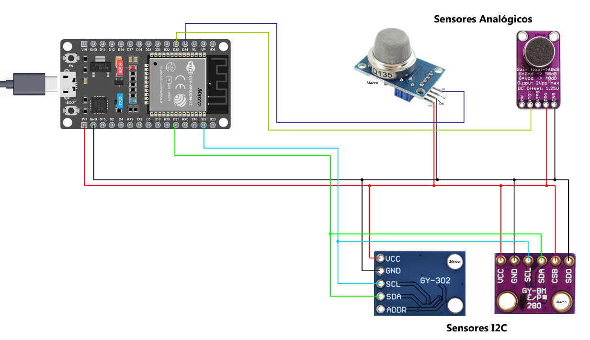

# 🏭 Dispositivo Inteligente de Supervisión Industrial

> ESP32 · MQTT · n8n · Ollama · InfluxDB · Grafana · Telegram · Gmail · Google Sheets

Sistema de monitorización ambiental para entornos industriales que captura datos de sensores en tiempo real, detecta anomalías automáticamente y genera diagnósticos técnicos mediante inteligencia artificial local, sin depender de servicios externos de IA.

---

## 📋 Tabla de contenidos

- [Estructura del repositorio](#-estructura-del-repositorio)
- [Descripción general](#-descripción-general)
- [Esquema de conexiones](#-esquema-de-conexiones)
- [Stack tecnológico](#-stack-tecnológico)
- [Arquitectura del sistema](#-arquitectura-del-sistema)
- [Flujo de n8n paso a paso](#-flujo-de-n8n-paso-a-paso)
- [Variables monitorizadas y umbrales](#-variables-monitorizadas-y-umbrales)
- [Salidas del sistema](#-salidas-del-sistema)
- [Rol de la IA](#-rol-de-la-ia)
- [Seguridad y privacidad](#-seguridad-y-privacidad)
- [Limitaciones y mejoras futuras](#-limitaciones-y-mejoras-futuras)

---

## 📁 Estructura del repositorio

Este proyecto está estructurado de forma modular para facilitar su replicación y mantenimiento, adaptado para trabajar con **Arduino IDE** y Docker:

```text
├── 📁 capturas/                # Material visual (Fotos, capturas y vídeos de demostración)
├── 📁 hardware/                # Planos físicos y esquemas del circuito
│   └── 📄 esquema-electrico-dispositivo.png   # Esquema de conexiones
├── 📁 esp32/                   # Firmware del microcontrolador (Arduino IDE)
│   ├── 📄 esp32.ino            # Código fuente principal del proyecto
│   └── 📄 config.h             # Credenciales privadas (WiFi/MQTT) — ignorado en Git
├── 📁 n8n/                     # Backend y automatización
│   └── 📄 workflow.json        # Flujo completo exportable de n8n
├── 📁 grafana/                 # Visualización avanzada
│   └── 📄 dashboard.json       # Plantilla del cuadro de mando interactivo
├── 📁 mosquitto/               # Infraestructura del Broker MQTT
│   ├── 📁 config/
│   │   └── 📄 mosquitto.conf   # Reglas de red y acceso del bróker
│   ├── 📁 data/                # Datos persistentes — ignorado en Git
│   └── 📁 log/                 # Registros de actividad — ignorado en Git
├── 📄 docker-compose.yml       # Orquestación de infraestructura local (Docker)
```

---

## 📝 Descripción general

Un microcontrolador **ESP32** conectado a 4 sensores captura continuamente variables ambientales críticas y las publica cada 5 segundos por **MQTT**. El orquestador **n8n** recibe esos datos y los procesa de forma automática:

- Los envía siempre a **InfluxDB** para visualizarlos en **Grafana** en tiempo real.
- Si los valores son normales, los registra en **Google Sheets**.
- Si se detecta una anomalía, activa dos cadenas de IA local (**Ollama + Qwen3**): una genera una alerta breve para **Telegram** y otra redacta un informe técnico completo que se envía por **Gmail**.

Todo el procesamiento de IA ocurre en local, por lo que ningún dato abandona la infraestructura propia.

---

## 🔌 Esquema de Conexiones

Aquí puedes ver cómo están conectados los sensores (BME280, BH1750, MQ135, MAX9814) al ESP32:



---

## 🛠️ Stack tecnológico

| Capa | Tecnología |
|---|---|
| **Hardware** | ESP32 + sensores (BME280, BH1750, MQ135, MAX9814) |
| **Protocolo** | MQTT |
| **Automatización** | n8n |
| **IA local** | Ollama · Modelo `qwen3:1.7b` |
| **Series temporales** | InfluxDB |
| **Dashboard** | Grafana |
| **Almacenamiento** | Google Sheets |
| **Alertas** | Telegram Bot API |
| **Informes** | Gmail API |

---

## 🏗️ Arquitectura del sistema

```
[ ESP32 + 4 Sensores ]
        │
        ▼  MQTT · topic: "estacion/datos" · cada 5s
 [ Broker MQTT ]
        │
        ▼
   [ n8n ]
        │
        ├──► [ InfluxDB ] ──► [ Grafana Dashboard ]   ← siempre, todos los datos
        │
        ├── Parseo JSON + Timestamp
        │
     [ Nodo IF ] ← evaluación de umbrales
        │
        ├── NORMAL ──► [ Google Sheets ]              ← registro histórico limpio
        │
        └── ANOMALÍA
                ├──► [ Ollama: alerta breve ]    ──► [ Telegram ]
                └──► [ Ollama: informe completo ] ──► [ Gmail ]
```

---

## ⚙️ Flujo de n8n paso a paso

### 1. MQTT Trigger
Escucha el tópico `estacion/datos`. Cada vez que el ESP32 publica un mensaje, este nodo lo captura y dispara el flujo.

### 2. Parseo y timestamp (Code JS)
Transforma el payload JSON del sensor añadiendo un `timestamp` limpio en formato `YYYY-MM-DD HH:MM:SS`.

### 3. Envío a InfluxDB (HTTP Request)
De forma paralela e incondicional, los datos se insertan en InfluxDB mediante una petición POST usando **InfluxDB Line Protocol**. Esto alimenta los dashboards de Grafana de forma continua.

```
lecturas_esp32,dispositivo=ESP32_Estacion1 temp=X,hum=X,gas=X,ruido=X,lux=X,pres=X
```

### 4. Nodo IF — Detección de anomalías
Evalúa los umbrales bajo lógica `OR`. Si cualquiera se supera, el flujo toma el camino de anomalía.

### 5A. Ruta normal → Google Sheets
Los datos se añaden como una nueva fila con el estado `"NORMAL"`.

### 5B. Ruta anomalía → IA + Alertas
Se ejecutan dos cadenas LLM en paralelo:

**Cadena 1 → Telegram (alerta rápida)**
- Prompt estricto: máximo 4 líneas, formato `Riesgo / Causa / Acción`.
- Un nodo JS limpia posibles artefactos del modelo antes de enviar.
- El mensaje incluye todos los valores del sensor, la anomalía detectada y el diagnóstico IA.

**Cadena 2 → Gmail (informe técnico)**
- Prompt estructurado: genera un informe en 5 secciones (`Diagnóstico`, `Riesgo`, `Causas`, `Recomendaciones`, `Conclusión`).
- Un nodo JS limpia el output del modelo.
- El correo se envía en HTML con tabla de métricas e informe formateado.

---

## 📊 Variables monitorizadas y umbrales

| Variable | Unidad | Umbral de alerta |
|---|---|---|
| Temperatura | °C | > 32 |
| Humedad | % | — (monitorizada, sin alerta) |
| Presión | hPa | — (monitorizada, sin alerta) |
| Gas ADC | valor analógico | > 1300 |
| Ruido | dB | > 30 |
| Luminosidad | lux | < 10 |

---

## 📤 Salidas del sistema

### Telegram
Alerta inmediata con métricas actuales, tipo de anomalía y diagnóstico breve generado por IA.

```
🚨 ALERTA INDUSTRIAL

📊 ESTADO DEL SISTEMA
Temperatura: 34.2 °C
Humedad: 61 %
...

⚠️ ANOMALÍA DETECTADA
Temperatura elevada

🧠 DIAGNÓSTICO IA
Riesgo: Sobrecalentamiento del sistema
Causa: Ventilación insuficiente
Acción: Revisar sistema de refrigeración
```

### Gmail
Correo HTML con tabla de métricas e informe técnico completo estructurado en 5 puntos.

### Google Sheets
Registro histórico de lecturas normales con columnas: `timestamp`, `temp`, `hum`, `pres`, `gas`, `lux`, `db`, `estado`.

### Grafana
Dashboard con gráficas de series temporales de todas las variables, alimentado por InfluxDB en tiempo real.

---

## 🧠 Rol de la IA

La IA no es simplemente un sistema de alertas condicionales. Actúa como un **analista técnico automático**:

- **Interpreta** la combinación de valores de los sensores en contexto.
- **Diagnostica** la causa probable del problema.
- **Evalúa** los riesgos asociados al entorno industrial.
- **Redacta** recomendaciones técnicas accionables en lenguaje formal.

El modelo utilizado es `qwen3:1.7b` ejecutado localmente con **Ollama**, sin conexión a ninguna API externa.

---

## 🔒 Seguridad y privacidad

- **IA 100% local**: el modelo `qwen3:1.7b` corre en la misma máquina con Ollama. Los datos de telemetría nunca salen de la infraestructura propia.
- **Credenciales cifradas**: todas las claves de API (Telegram, Gmail, Google Sheets, InfluxDB) se almacenan de forma segura dentro del sistema de credenciales de n8n.
- **Sin dependencias de IA en la nube**: no se usa OpenAI, Anthropic ni ningún servicio similar, eliminando riesgos de exposición de datos y costes por tokens.

---

## ⚠️ Limitaciones y mejoras futuras

**Limitación actual — saturación de alertas**
Con datos cada 5 segundos, una anomalía persistente genera mensajes continuos en Telegram y correos repetidos. Se contempla implementar un sistema de **cooldown** (bloqueo temporal entre alertas de 1-5 minutos) mediante un nodo de espera en n8n.

**Mejoras planificadas**
- Implementar el cooldown para reducir la saturación de notificaciones.
- Añadir más sensores o tipos de variables.
- Usar modelos LLM locales más avanzados si el hardware lo permite.
- Expandir los dashboards de Grafana con análisis predictivo basado en el histórico de InfluxDB.
- Añadir un panel web propio para visualización y configuración de umbrales.

---

> Proyecto desarrollado como práctica de automatización IoT con IA · ESP32 + n8n + Ollama
